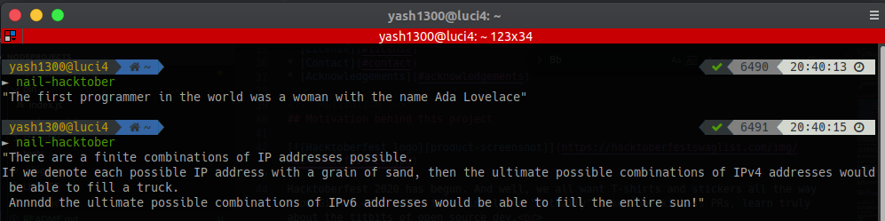

<!-- PROJECT LOGO -->
<br />
<p align="center">
  
  <h3 align="center"> :rocket: Let's nail Hacktoberfest 2020 the right way :rocket: </h3>

  <p align="center">
    Your one-stop place for diving into the world of Open Source Dev by learning and making "legit" open source contributions with ease and most importantly, fun!<br>
    And meanwhile, cracking the hacktoberfest 2020 too :sunglasses:
    <br />
    <br />
    ·
    <a href="https://github.com/yashvardhan-kukreja/nail-hacktoberfest/issues/new?assignees=&labels=bug&template=bug_report.md&title=">Report Bug</a>
    ·
    <a href="https://github.com/yashvardhan-kukreja/nail-hacktoberfest/issues/new?assignees=&labels=feature&template=feature_request.md&title=">Request Feature</a>
  </p>
</p>


<!-- TABLE OF CONTENTS -->
## Table of Contents

* [Motivation behind this project](#motivation-behind-this-project)
* [About the Project](#about-the-project)
  * [Built With](#built-with)
* [Getting Started](#getting-started)
  * [Prerequisites](#prerequisites)
  * [Project Setup](#project-setup)
* [Usage](#usage)
* [Contributing](#contributing)
* [License](#license)
* [Contact](#contact)
* [Acknowledgements](#acknowledgements)

<!-- MOTIVATION -->
## Motivation behind this project

<p align="center">

</p>

Hacktoberfest 2020 has begun. And well, we all want T-shirts and stickers all the way from Github. But well, this time let's "actually" make some kickass PRs, learn truly about the titbits of open source dev.<br>
And this project is gonna make you do that.<br>
This project involves guides and fully explained and exemplified steps to contribute to this (or essentially any other) open source repository **the right way**

Let me say two things:

- It's incredibly easier than it looks.
- Once you get even 1 single PR merged in this repository, you would already be versed with some nice open source practices.

Now, jump to the next section to know about this project and realise how easy it is (and even to contribute to it).

If you like this idea and project, then do :star2: this repo. Will make me really happy :P

<!-- ABOUT THE PROJECT -->
## About The Project

Now, coming to this project and its functionality.
This is an extremely simple CLI (command-line-interface) which will give you random fun facts related to computer science, programming or whatever. <br>
The facts are contained within the code itself (here lies your contributions' opportunities ;) ) , hence, you don't need internet access to get those facts.

Later on, we can look forward to adding any other add-ons like jokes, quotes, and what not.

The idea is to bring you to the open source community and make you contribute to it and learn lots and lots.


### Built With
* [Node.js](https://nodejs.org/en/)
* [NPM](https://www.npmjs.com/)


<!-- GETTING STARTED -->
## Getting Started

This is an example of how you may give instructions on setting up your project locally.
To get a local copy up and running follow these simple example steps.

### Prerequisites

Please setup the following tools for this project to execute successfully in your computer:
* npm
```sh
sudo apt-get install npm -y
```
* node (nodejs, whatever you call :P)
```sh
sudo apt-get install node -y
```

### Project Setup

1. Clone this repo
```sh
git clone git@github.com:yashvardhan-kukreja/nail-hacktoberfest.git
```
2. Hope into the project directory
```sh
cd nail-hacktoberfest
```
3. Install NPM packages
```sh
npm install
```
4. Install the CLI
```sh
sudo npm install -g .
```
5. Run it :rocket:
```sh
nail-hacktoberfest
```

### Docker Setup

This project can also be setup using Docker.  Docker can be installed on a variety of platforms [here](https://docs.docker.com/engine/install/)

1. Clone this repo
```sh
git clone https://github.com/yashvardhan-kukreja/nail-hacktoberfest.git
```
2. Hop into the project directory
```sh
cd nail-hacktoberfest
```
3. Build the Docker image
```sh
docker build -t <username>/nail-hacktoberfest .
```
4. Run using Docker
```sh
docker run <username>/nail-hacktoberfest
```


<!-- USAGE EXAMPLES -->
## Usage



<!-- CONTRIBUTING -->
## Contributing
**Nailing the Hacktoberfest** :sunglasses:

Contributions are what make the open source community such an amazing place to be learn, inspire, and create. Any contributions you make are **greatly appreciated**.<br>

Checkout the issues [here](https://github.com/yashvardhan-kukreja/nail-hacktoberfest/issues)

For getting a detailed explanation and guide to contributing to this repo (or essentially any repo) the right way in under 5-10 minutes, please refer to [CONTRIBUTING.md](https://github.com/yashvardhan-kukreja/nail-hacktoberfest/blob/master/CONTRIBUTING.md)


<!-- LICENSE -->
## License

Distributed under the MIT License. See [LICENSE](https://github.com/yashvardhan-kukreja/nail-hacktoberfest/blob/master/LICENSE) for more information.


<!-- CONTACT -->
## Contact

Yashvardhan Kukreja 
* [My website](https://www.yashkukreja.com/)
* Twitter - [@yashkukreja98](https://twitter.com/yashkukreja)
* Github - [yashvardhan-kukreja](https://github.com/yashvardhan-kukreja)
* Medium - [yash.kukreja.98](http://medium.com/@yash.kukreja.98)
* LinkedIn - [yashvardhan-kukreja](https://www.linkedin.com/in/yashvardhan-kukreja/)


<!-- ACKNOWLEDGEMENTS -->
## Acknowledgements
* [GitHub Emoji Cheat Sheet](https://www.webpagefx.com/tools/emoji-cheat-sheet)
* [Choose an Open Source License](https://choosealicense.com)
* [GitHub Pages](https://pages.github.com)